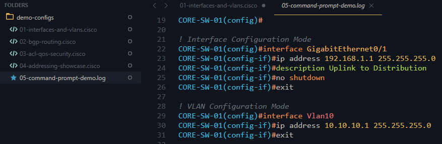
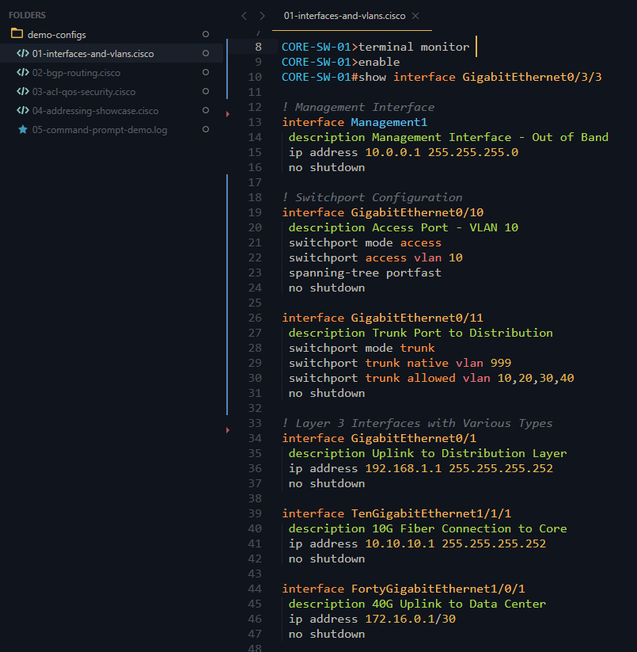

# 🌐 Cisco Configuration Syntax Highlighting for Sublime Text

<p align="center">
  <strong>A fresh take on a comprehensive syntax highlighter for Cisco IOS, NX-OS, and IOS-XE configurations</strong>
</p>

<p align="center">
  <a href="https://github.com/badwifi/CiscoSyntax-Badwifi-Sublime-syntax/blob/main/LICENSE">
    
  </a>
  <a href="https://www.sublimetext.com/">
    
  </a>
</p>

---

## ✨ Features

**CiscoSyntax by BadWifi** brings intelligent syntax highlighting to your Cisco configuration files, making them easier to read, understand, and troubleshoot.

### 🎯 Highlights Include:

- **📡 Interface Recognition** - All interface types (Ethernet, GigabitEthernet, TenGigabitEthernet, Port-Channel, Loopback, VLAN, Tunnel, Serial, Cellular, and more)
- **🌍 IP Addressing** - IPv4, IPv6 (full and condensed), CIDR notation, and MAC addresses
- **🔐 Security & Crypto** - ACLs (access-lists, access-groups), crypto maps, transform-sets, and object-groups
- **🔀 Routing Protocols** - BGP configurations (peer-groups, peer-policies, peer-sessions, neighbors)
- **🏷️ VRF Support** - VRF definitions and forwarding instances
- **📊 QoS Policies** - Class-maps, policy-maps, and service-policies
- **💬 Comments & Descriptions** - Clearly distinguished configuration comments and interface descriptions
- **🎨 Command Modes** - Visual distinction between user mode (#) and privileged mode (>)
- **🚫 Disabled Commands** - Special highlighting for `no` and `default` commands

### 📁 Supported File Extensions:
- `.ios`
- `.cisco`
- `.config`
- `.log`
- *note that .txt can be defaulted to this by selecting*

`View->Syntax->Open all with current extension as...`

---

## 📸 Screenshots

All Screenshots taken using Ayu-dark sublime theme. 

### Screenshot Commands Prompt


### Screenshot Interface and VLANs



---

## 📦 Installation

### 🚀 Via Package Control (Coming Soon)

Once published to Package Control:

1. Open Sublime Text
2. Press `Ctrl+Shift+P` (Windows/Linux) or `Cmd+Shift+P` (Mac)
3. Type "Package Control: Install Package"
4. Search for "CiscoSyntax BadWifi"
5. Press Enter to install

### 📥 Manual Installation

**Option 1: Using Git (Recommended)**

1. Navigate to your Sublime Text `Packages` folder:
   - **Windows**: `%AppData%\Sublime Text\Packages\`
   - **Mac**: `~/Library/Application Support/Sublime Text/Packages/`
   - **Linux**: `~/.config/sublime-text/Packages/`

2. Clone this repository:
   ```bash
   git clone https://github.com/badwifi/CiscoSyntax-Badwifi-Sublime-syntax.git "CiscoSyntax BadWifi"
   ```

3. Restart Sublime Text

**Option 2: Direct Download**

1. Download the [latest release](https://github.com/badwifi/CiscoSyntax-Badwifi-Sublime-syntax/releases)
2. Extract the contents to your Sublime Text `Packages` folder (see paths above)
3. Ensure the folder is named `CiscoSyntax BadWifi`
4. Restart Sublime Text

---

## 🎯 Usage

### Automatic Detection

The syntax highlighter will automatically activate for files with these extensions:
- `.ios`
- `.cisco`
- `.config`
- `.log`

### Manual Selection

For other file types:
1. Open your Cisco configuration file
2. Click on the syntax name in the bottom-right corner (or press `Ctrl+Shift+P` / `Cmd+Shift+P`)
3. Select "Set Syntax: CiscoSyntax BadWifi"

---

## 🤝 Contributing

Contributions are welcome! If you find a bug or want to add support for additional Cisco commands:

1. Fork the repository
2. Create a feature branch (`git checkout -b feature/your-feature`)
3. Commit your changes (`git commit -m 'Add some feature'`)
4. Push to the branch (`git push origin feature/your-feature`)
5. Open a Pull Request

### 🐛 Reporting Issues

Found a bug or missing syntax highlighting? [Open an issue](https://github.com/badwifi/CiscoSyntax-Badwifi-Sublime-syntax/issues) with:
- A description of the problem
- Sample configuration snippet
- Expected vs actual highlighting behavior

---

## 📄 License

This project is licensed under the MIT License - see the [LICENSE](LICENSE) file for details.

---

## 💙 Support

If you find this syntax highlighter useful, please:
- ⭐ Star this repository
- 🐛 Report bugs or request features via [Issues](https://github.com/badwifi/CiscoSyntax-Badwifi-Sublime-syntax/issues)
- 🔀 Submit pull requests to improve the highlighting

---

<p align="center">
  Created and maintained by Michael Burk, CCIE #50207 <a href="https://badwifi.dev">Badwifi.dev</a>
</p
